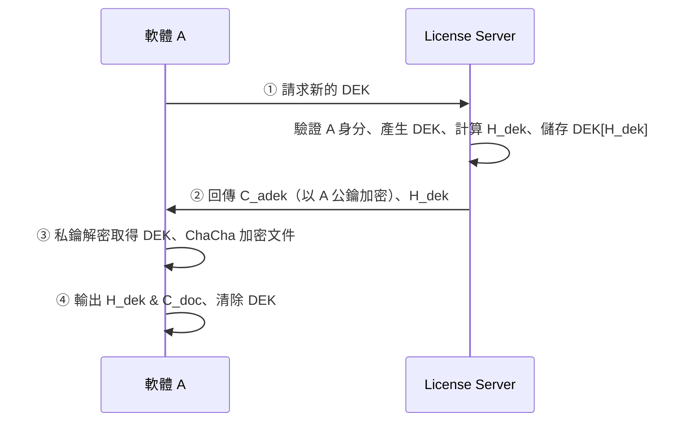
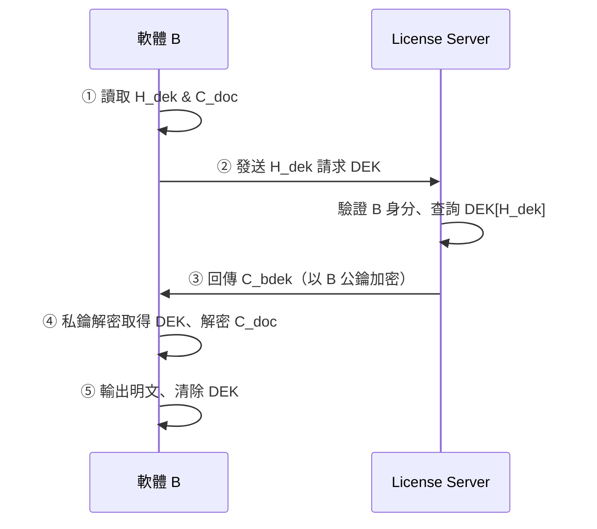
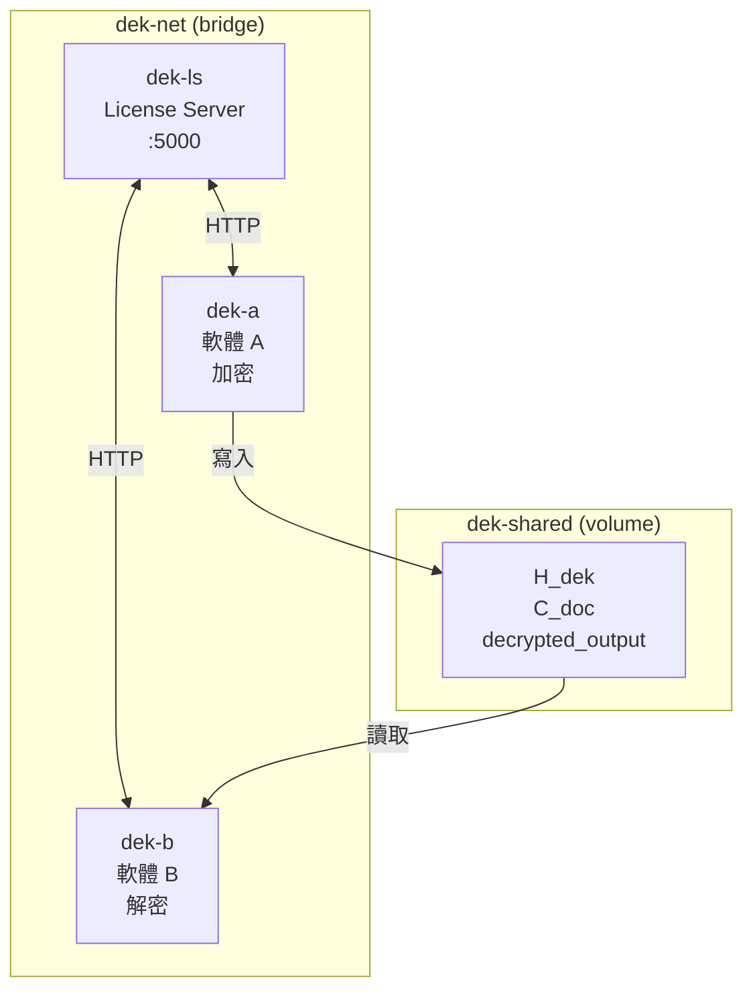

# DEK PoC - 資料加密金鑰派發與加解密流程

三容器架構：**License Server (LS)**、**軟體 A（加密）**、**軟體 B（解密）**，模擬 DEK 由 LS 派發、A 加密輸出、B 向 LS 索取 DEK 解密的完整流程。

---

## 一、架構與流程說明

### 1.1 角色與職責

| 角色 | 容器名稱 | 職責 |
|------|----------|------|
| **License Server (LS)** | `dek-ls` | 產生 DEK、以客戶端公鑰封裝 DEK、依 H_dek 查詢並以 B 公鑰封裝 DEK |
| **軟體 A** | `dek-a` | 向 LS 請求 DEK → ChaCha 加密文件 → 輸出 H_dek & C_doc |
| **軟體 B** | `dek-b` | 以 H_dek 向 LS 索取 DEK → 解密 C_doc → 輸出明文 |

### 1.2 流程圖

**第一階段：A 加密**



**第二階段：B 解密**



**流程概觀**

```
[A 加密]  請求 DEK → LS 產生並以 A 公鑰加密回傳 → A 解密 DEK → ChaCha 加密 → 輸出 H_dek & C_doc
[B 解密]  讀取 H_dek & C_doc → 向 LS 請求 DEK → LS 以 B 公鑰加密回傳 → B 解密 DEK → 解密 C_doc
```

### 1.3 技術細節

| 項目 | 說明 |
|------|------|
| **DEK** | 32 bytes 隨機金鑰，用於 ChaCha20-Poly1305 |
| **H_dek** | SHA-256(DEK)，作為 DEK 索引供 LS 查詢 |
| **C_adek / C_bdek** | RSA-OAEP(SHA256) 封裝的 DEK，分別以 A/B 公鑰加密 |
| **C_doc** | 12 bytes nonce + ChaCha20-Poly1305 密文 |

---

## 二、三容器 Docker 執行（主要方式）

### 2.1 前置需求

- Docker
- Docker Compose

### 2.2 執行指令

```bash
cd dek-poc
docker-compose up --build
```

### 2.3 預期輸出

```
dek-ls  |  * Serving Flask app 'license_server'
dek-ls  |  [LS] 客戶端 A 註冊公鑰完成
dek-ls  |  [LS] 收到 A 的 DEK 請求
dek-a   |  ① 載入/產生 A 的 RSA 金鑰對，向 LS 註冊公鑰
dek-a   |  ② 向 LS 請求新的 DEK
...
dek-a   |  [A] 加密完成
dek-a exited with code 0
dek-b   |  ① 載入/產生 B 的 RSA 金鑰對...
dek-b   |  [B] 解密完成 → /data/decrypted_output.txt
dek-b   |  *** PoC 成功：三容器 DEK 派發 → A 加密 → B 解密 流程驗證通過 ***
dek-b exited with code 0
```

`license-server` 會持續運行，按 **Ctrl+C** 可停止全部服務。

### 2.4 三容器架構示意



---

## 三、測試人員操作指南

### 3.1 測試環境準備

1. 安裝 Docker 與 Docker Compose
2. 取得專案：`cd` 至 `dek-poc` 目錄

### 3.2 基本功能測試

**步驟 1：啟動三容器**

```bash
docker-compose up --build
```

**步驟 2：檢查輸出**

| 檢查項目 | 預期結果 |
|----------|----------|
| 建置 | 三個服務皆顯示 Built |
| LS 啟動 | 出現 `Serving Flask app 'license_server'` |
| A 執行 | 顯示 ①～⑤ 步驟，最後 `[A] 加密完成` |
| A 退出 | `dek-a exited with code 0` |
| B 執行 | 顯示 ①～⑤ 步驟，最後 `[B] 解密完成` |
| B 退出 | `dek-b exited with code 0` |
| 成功訊息 | `*** PoC 成功...***` |

**步驟 3：驗證解密結果**

```bash
# 另開終端，查看共用 volume 中的解密結果
docker run --rm -v dek-poc_dek-shared:/data alpine cat /data/decrypted_output.txt
```

預期內容應與 `demo_input.txt` 一致（預設為「這是 PoC 示範文件...」）。

### 3.3 進階測試：修改輸入檔

若要測試自訂內容：

1. 修改專案內的 `demo_input.txt`
2. 重新建置並執行：

```bash
docker-compose build --no-cache
docker-compose up
```

3. 比對 `decrypted_output.txt` 與 `demo_input.txt` 是否相同

### 3.4 常見問題排查

| 狀況 | 可能原因 | 處理方式 |
|------|----------|----------|
| A 報錯 `unknown client_id` | A 比 LS 早發出請求 | 依 `depends_on` 順序，LS 應先啟動，必要時重跑 |
| B 報錯 `h_dek not found` | LS 重啟導致 DEK 遺失 | 使用 `docker-compose up` 一次跑完全程，勿分開重啟 LS |
| 連線被拒 | 容器網路異常 | `docker-compose down` 後再 `docker-compose up --build` |
| 建置失敗 | `demo_input.txt` 缺失 | 確認專案內有 `demo_input.txt` 檔案 |

### 3.5 停止與清理

```bash
# 停止服務（含 Ctrl+C 後）
docker-compose down

# 刪除 volume（下次會重新產生加密輸出）
docker-compose down -v
```

---

## 四、其他執行方式

### 4.1 單一容器（快速驗證）

```bash
docker build -t dek-poc .
docker run --rm dek-poc
```

單一容器會依序執行 LS → A → B，並在結束時比對結果。

### 4.2 本機執行（分終端手動操作）

```bash
# 終端 1：啟動 LS
python license_server.py

# 終端 2：執行 A（需先 pip install -r requirements.txt）
python software_a.py demo_input.txt encrypted_output

# 終端 3：執行 B
python software_b.py encrypted_output decrypted_output.txt
```

### 4.3 本機單腳本執行

```bash
pip install -r requirements.txt
python run_demo.py
```

**Windows 建議**（正確顯示中文）：  
`$env:PYTHONIOENCODING="utf-8"; python run_demo.py`

---

## 五、輸出檔案說明

| 檔案 | 位置（三容器） | 說明 |
|------|----------------|------|
| `encrypted_output.h_dek` | `/data/`（volume） | DEK 的 SHA-256 雜湊，B 向 LS 請求時使用 |
| `encrypted_output.c_doc` | `/data/`（volume） | ChaCha20-Poly1305 密文（含 12-byte nonce） |
| `decrypted_output.txt` | `/data/`（volume） | B 解密後的明文 |
| `demo_input.txt` | `/app/`（映像內） | 預設加密來源檔案 |

---

## 六、專案結構

```
dek-poc/
├── docker-compose.yml    # 三容器編排
├── Dockerfile
├── requirements.txt
├── license_server.py     # LS 服務
├── software_a.py         # 軟體 A（加密）
├── software_b.py         # 軟體 B（解密）
├── run_demo.py           # 單一容器/本機一鍵執行
├── demo_input.txt        # 預設輸入檔
└── README.md
```
